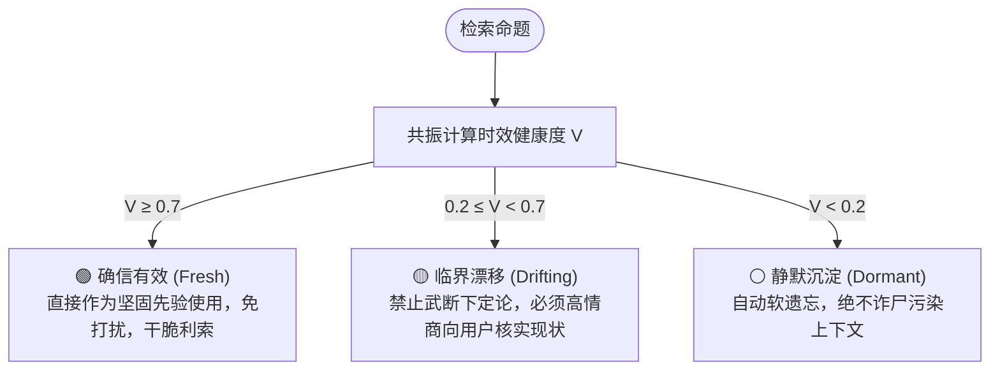
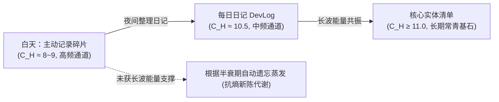

# Constancy MCP (人基常热认知记忆外脑)

> **让大模型真正懂得“主动记、自动忘、懂分寸、读空气”的长期记忆系统。**  
> 基于控制论、心理物理学与多尺度信号处理统一模型：**人基常热动力学（Anthropocentric Chrono-Thermal Dynamics, ACTD）**。

---

## 💡 为什么需要 Constancy MCP？

当前所有主流大模型的长期记忆与 RAG 系统（ChatGPT Memory、Mem0、传统向量库），都存在致命的**“常度错配（Constancy Mismatch）”与“尺度盲（Scale-Blindness）”**：

* ❌ **无差别吞噬**：把用户的口嗨、吐槽、临时预设当成“永久真理”保存，信噪比极低；
* ❌ **永生不死与幽灵诈尸**：默认所有数据的常度是 $C_H = \infty$。把半年前废弃的旧方案在今天当成圣旨翻出来；
* ❌ **单一标量热度的失真**：一个简单的计数器无法区分“刚才疯狂点了 10 次”和“过去两年里细水长流被验证了 10 次”；
* ❌ **不会“读空气”**：缺乏时间锚点与时效健康度。比如把上周的“气象局说明天下雨”当成今天的事实，阴阳怪气地提醒用户“今天出门带伞”，场面极度尴尬。

**真实的人脑智能，核心不是“死记硬背”，而是“会遗忘（Adaptive Forgetting）”与“多尺度新陈代谢”。**

---

## 🧬 理论双翼：人基常热动力学 (ACTD)

本项目将**《人基常度理论》（$C_H$）**与**《多尺度对数意图热度谱》（$\mathbf{h}$）**统一融合，构成认知二象性模型：

$$\mathcal{S} = \big\langle C_H^{\text{prior}},\; \mathbf{h}(t) \big\rangle$$

* **骨架（本性先验 $C_H$）**：基于智人动作电位 $t_0 = 1\text{ ms}$ 与最小可觉差 $\delta_{\text{JND}}$ 界定的固有预期寿命；
* **血肉（动态能谱 $\mathbf{h} \in \mathbb{R}^7$）**：基于人类意图事件驱动的多尺度连续懒衰减能量谱（覆盖 1 分钟到 2 年）。

### 坐标对齐公理：
$$C_H = s + \log_{10}(60,000) \approx \mathbf{s + 4.78}$$

| 通道 $k$ | 尺度 $s_k$ | 半衰期 | 对应常度 $C_H$ | 智人认知与交互层级 | 典型示例 |
| :---: | :---: | :---: | :---: | :---: | :--- |
| **0** | $0$ | 1 分钟 | $\approx 4.78$ | **微观注意力** | 当前打开、光标停留 |
| **1** | $1$ | 10 分钟 | $\approx 5.78$ | **单次会话** | 一次连续调试或编码 |
| **2** | $2$ | 100 分钟 | $\approx 6.78$ | **半日攻坚** | 半天工作单元 |
| **3** | $3$ | 16.7 小时 | $\approx 7.78$ | **生理昼夜** | 当日日记、时效预报（如天气预报 $C_H \approx 7.8$） |
| **4** | $4$ | 1 周 | $\approx 8.78$ | **冲刺周期** | 本周主线任务、临时点子检验期 |
| **5** | $5$ | 2.3 个月 | $\approx 9.78$ | **演进阶段** | 架构选型、接口标准稳定期 |
| **6** | $6$ | 2 年 | $\approx 10.78$ | **常青底噪** | 核心实体百科、硬件物理参数 |

> 💡 **标尺映射说明**：7 维谱系最大追踪通道 $s=6$ 对应半衰期约 2 年 ($C_H \approx 10.78$)，作为日常动力学的最长意图载波。对于长期架构规范或硬件基石实体 ($C_H \ge 11.0$，如 10 年期实体 $C_H = 11.5$)，其热度载波锚定在通道 6，其有效时效衰减 $\tau = 10^{C_H}$ 严格遵循物理基石先验。  
> 完整形式化推导请参阅 [docs/ACTD_SPEC.md](docs/ACTD_SPEC.md) 与 [docs/THEORY.md](docs/THEORY.md)。

---

## ⚙️ 核心机制：频段共振与决策三态机

通过常度频段共振提取有效热度 $H_{\text{eff}}$，计算命题的时效健康度 $V$：

$$V(t) = \exp\left( - \frac{\text{ms}(t_{\text{now}} - t_{\text{last\_strong}})}{10^{C_H^{\text{dynamic}}}} \cdot \frac{1}{1 + \ln(1 + H_{\text{eff}})} \right)$$

* **核心防自热公理（被动检索 $\neq$ 现实确证）**：AI 发起 `search_memory` 仅作为弱信号探针，仅激发短暂工作记忆 ($s=0$)，绝不泄漏至长波通道，严禁凭空拉高 $C_H$，从数学上根除“频繁被搜导致陈旧记忆永不衰减”的幽灵诈尸后门。

大模型在检索记忆时，不再是冷冰冰地提取旧文本，而是获得清晰的**行动决策指南**：

### 高情商沟通实测对比：
* **传统 RAG**：“*你半年前不是说讨厌前端吗？你今天怎么又写前端了？*”（机械、杠精、翻旧账）
* **Constancy MCP 引导的大模型**：“*我注意到半年前记录过您倾向于纯终端输出；考虑到该模块已跨越常规迭代周期，请问目前是否依然沿用此交互规范？*”（审慎、得体、会读空气）

---

## 🛠️ MCP 工具接口规范 (Tools)

通过标准 Model Context Protocol 提供给 Claude / Cursor 等 AI Agent：

1. `log_memory(content, c_h?, type?, entities?, tags?)`  
   * 主动打点记事。不记闲聊废话，只存高信噪比事实或阶段性决策。
2. `search_memory(query, limit?, type?, entity?, min_validity?, include_retired?)`  
   * 语义检索 + ACTD 连续懒衰减时效仲裁。综合语义匹配分与时效健康度排序，返回带情商指示牌与动力学指标的记忆卡片。默认过滤 $V < 0.2$ 的沉淀态，物理屏蔽废弃记忆。
3. `get_daily_timeline(date, include_retired?)`  
   * 按时间顺序提取某一天全部碎片与动力学热度指标 ($C_H$、健康度 $V$、状态标签)，供大模型生成每日研发日记（DevLog）与夜间蒸馏。
4. `confirm_memory(id, note?, c_h?, revive?)`  
   * **🟡 状态闭环工具**：当用户核实某条临界记忆依然有效时调用，强信号刷新验证时间戳并注入热度，使记忆满血重归 🟢 确信有效。若记忆已废弃，可传入 `revive: true` 撤销废弃复活。
5. `retire_memory(id, reason)`  
   * **抗熵归档工具**：显式设置 `retired: true`，保留原业务分类 `type`，将已过时或已被推翻的记忆标记失效沉淀 ($V \to 0$)，杜绝死灰复燃。
6. `upsert_entity(name, description, aliases?, relations?)`  
   * 维护跨越周期的高阶常青实体百科清单 ($C_H \ge 11.0$)。
7. `save_note(content, title?, base64?, mime_type?, c_h?, tags?)`  
   * **极简记事本/客观存根**：专为“书记官记录”（用户交代“帮我记着点……”）与“LLM 工具性存根”（URI、代码片段、数据指纹）设计，原汁原味保存（上限 10KB），绝不作有损改写。支持可选的独立 BASE64 槽（上限 10KB，不参与向量化，自动计算服务端 SHA-256 校验和），默认常度 8.8（配置/速查类自动为 11.0）。
8. `get_note(id)`  
   * **按需载荷与审计追溯**：根据便签 ID 精确取回完整原始内容、Base64 载荷、SHA-256 校验和及历史修改审计链 (`revisions`)。
9. `list_notes(tag?, limit?, include_retired?)`  
   * **确定性标签枚举**：基于 Qdrant scroll 物理枚举便签与客观存根（非向量相似度检索，杜绝阈值截断漏选）。适用于“我有哪些待办”、“列出所有配置存根”等枚举场景。
10. `update_note(id, content?, mode?, title?, tags?, base64?, mime_type?, c_h?)`  
    * **版本可追溯编辑**：修改便签内容（支持覆盖与追加模式）、分类标签或常度。修改时自动归档历史版本快照至 `revisions` 审计链（最多保留 5 版）；内容或标题改动时自动触发 Voyage-3 重算语义向量。
11. `get_blob_url(id)`  
    * **Capability 下载链接生成**：为便签中存储的二进制数据生成 5 分钟带签名下载链接。供客户端或 Claude 代码沙箱通过 `curl` 直接下载，完全避免大段 Base64 经过 LLM 对话上下文消耗 Token 或产生截断转义损耗。
12. `create_upload_url(title?, content?, mime_type?, tags?, c_h?)`  
    * **Capability 直传链接生成**：预分配便签 ID 并生成 5 分钟带签名直接上传链接。允许客户端或 Claude 沙箱通过 `curl -X PUT` 直接将二进制流存入，完全不经过 LLM 对话上下文传输 Base64。

---

## 🏗️ 飞轮运作流：白天打点，夜间蒸馏，长波自愈

---

## 🗺️ 路线图 (Roadmap)

- [x] 《人基常度》形式化理论定义与标尺 ([docs/THEORY.md](docs/THEORY.md))
- [x] 《人基常热动力学 ACTD v1.0》统一规范 ([docs/ACTD_SPEC.md](docs/ACTD_SPEC.md))
- [x] 数学自洽性审计与 4 大典型/极端场景全推演 ([docs/VERIFICATION.md](docs/VERIFICATION.md))
- [x] 基于 Qdrant + Cloudflare Worker 的边缘向量与 ACTD 算法引擎
- [x] OAuth 2.1 RFC 8414 + 1 年免密动态注册 (Claude Custom Connectors 支持)
- [ ] 官方 TypeScript / Python 本地 MCP Server 实现
- [ ] Claude Desktop / Cursor / Antigravity 一键安装配置指南
- [ ] 自动化每日日记提取与实体清单蒸馏 Prompt 模版

---

## 📄 开源协议

本项目采用 [MIT 许可证](LICENSE)。
