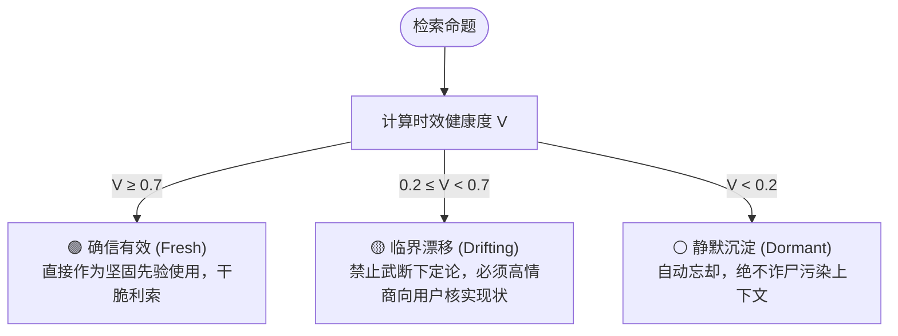
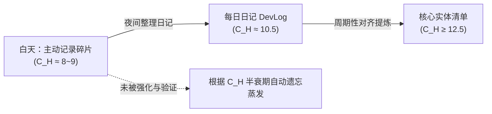

# Constancy MCP (人基常度认知记忆外脑)

> **让大模型真正懂得“主动记、自动忘、懂分寸、读空气”的长期记忆系统。**  
> 基于控制论与心理物理学形式化指标：**人基常度（Anthropocentric Constancy Index, $C_H$）**。

---

## 💡 为什么需要 Constancy MCP？

当前几乎所有主流大模型的长期记忆与 RAG 系统（ChatGPT Memory、Mem0、传统向量库），都存在致命的**“常度错配（Constancy Mismatch）”**：

* ❌ **无差别吞噬**：把用户的口嗨、吐槽、临时预设当成“永久真理”保存，信噪比极低；
* ❌ **永生不死与幽灵诈尸**：默认所有数据的常度是 $C_H = \infty$。把半年前废弃的旧方案在今天当成圣旨翻出来；
* ❌ **不会“读空气”**：缺乏时间锚点与时效健康度。比如把上周的“气象局说明天下雨”当成今天的事实，阴阳怪气地提醒用户“今天出门带伞”，场面极度尴尬。

**真实的人脑智能，核心不是“记性好”，而是“会遗忘（Adaptive Forgetting）”。**

---

## 🧬 核心理论地基：人基常度 ($C_H$)

本项目形式化引入**《人基常度理论》（Anthropocentric Constancy Index）**作为记忆系统的数学地基：

$$C_H = \log_{10}\left(\frac{T_{\text{stable}}}{t_0}\right)$$

* **$t_0 = 1\text{ ms}$**：智人动作电位的物理极限，当下感知的最小颗粒度。
* **$T_{\text{stable}}$**：在智人最小可觉差（$\delta_{\text{JND}}$，韦伯-费希纳定律）约束下，该命题能保持“可预期不变性”的持续时长。

| 常度 ($C_H$) | 典型寿命 $T$ | 对应信息类型 | 典型示例 |
| :---: | :---: | :--- | :--- |
| **8.0** | $\approx 1$ 天 | 强时效事件 / 动态预报 | “明天下午有阵雨” ($C_H \approx 7.8$) |
| **9.0** | $\approx 11.5$ 天 | 阶段性开发状态 / 冲刺目标 | “本周正在排查图片搜索的 EXIF 提取 Bug” |
| **10.5** | $\approx 1$ 年 | 技术架构选型 / 偏好认知 | “前端喜欢用轻量原生单页，不用重型框架” |
| **12.5** | $\approx 100$ 年 | 硬件事实 / 核心常识 | “Pixel 6a 主摄光圈为 f/1.73” |
| **$\infty$** | 永恒 | 数学与逻辑真理 | $1 + 1 = 2$ |

> 完整学术级理论定义请参阅 [docs/THEORY.md](docs/THEORY.md)。

---

## ⚙️ 核心架构与决策三态机

通过 **【时间戳】+【人基常度 $C_H$】+【活跃热度 $H$】** 计算命题的时效有效度 $V$：

$$V = \exp\left( - \frac{\Delta t}{10^{C_H}} \cdot \frac{1}{1 + \ln(1 + H)} \right)$$

大模型在检索记忆时，不再是冷冰冰地提取旧文本，而是获得清晰的**行动决策指南**：

### 高情商沟通对比：
* **传统 RAG**：“*你半年前不是说讨厌前端吗？你今天怎么又写前端了？*”（机械、杠精）
* **Constancy MCP 引导的大模型**：“*我注意到半年前记录过您倾向于纯终端输出；考虑到该模块已迭代至新周期，请问目前是否依然沿用此交互规范？*”（审慎、得体）

---

## 🛠️ MCP 工具接口 (Tools)

通过标准 Model Context Protocol 提供给 Claude / Cursor 等 AI Agent：

1. `log_memory(content, c_h?, type?, entities?, tags?)`  
   * 主动打点记事。不记闲聊废话，只存高信噪比事实或阶段性决策。
2. `search_memory(query, limit?, min_validity?)`  
   * 语义检索 + $V$ 值时效仲裁，返回带情商状态指示牌的记忆卡片。
3. `get_daily_timeline(date)`  
   * 按时间顺序提取某一天全部碎片，供大模型生成每日研发日记（DevLog）。
4. `upsert_entity(name, description, aliases?, relations?)`  
   * 维护跨越周期的高常度核心实体百科清单。

---

## 🏗️ 飞轮运作流：白天打点，夜间蒸馏

---

## 🗺️ 路线图 (Roadmap)

- [x] 《人基常度》形式化理论定义与标尺 ([docs/THEORY.md](docs/THEORY.md))
- [ ] 基于 Qdrant + Cloudflare Worker 的边缘向量与 $V$ 算法服务
- [ ] 官方 TypeScript / Python 本地 MCP Server 实现
- [ ] Claude Desktop / Cursor / Antigravity 一键安装配置指南
- [ ] 自动化每日日记提取与实体清单蒸馏 Prompt 模版

---

## 📄 开源协议

本项目采用 [MIT 许可证](LICENSE)。
