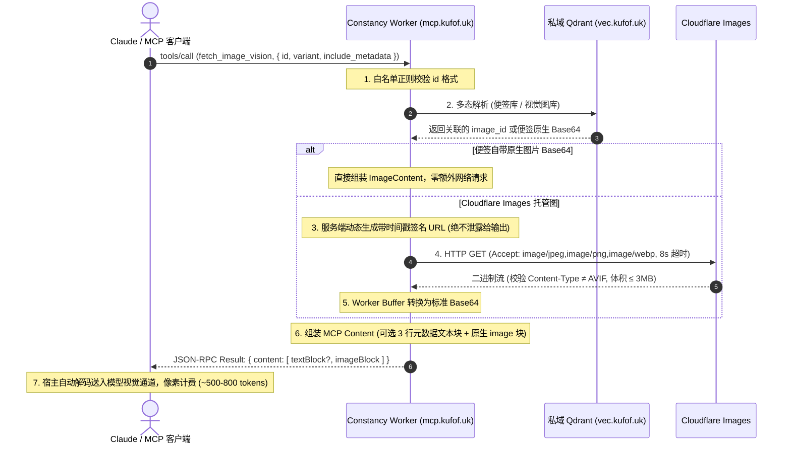

# 需求与设计规范：`fetch_image_vision` 视觉直读工具

## 1. 架构目标与痛点解决

### 1.1 现状痛点
在目前的 Constancy MCP 架构中，图片资产检索（`search_memory` / `get_blob_url`）仅返回 Cloudflare Images 的 HTTP 签名链接：
- **无沙箱环境完全致盲**：在 Claude.ai 网页端、手机端或无本地终端的会话中，模型无法执行 `curl`，因而彻底丧失看图能力；
- **有沙箱环境链路繁重**：模型需要先发起 `curl` 下载至沙箱磁盘，再调用 `view` 打开文件，耗费 2 轮额外往返与磁盘 I/O；
- **文本 Base64 灾难**：若将图像数据作为纯文本字符串输出，一张 300KB 的图片将消耗约 10 万个文本 Token，极易撑爆上下文。

### 1.2 解决方案
新增 `fetch_image_vision` 工具，利用 Model Context Protocol (MCP) 原生多模态协议块 `ImageContent`（`{ type: "image", data: "base64", mimeType: "..." }`）：
- **全端直接载入视觉通道**：无需客户端具备代码执行或下载沙箱，图片由 MCP Worker 服务端拉取并编码，直接推送进模型的视觉 Context；
- **视觉像素计费（极低 Token 消耗）**：走 Anthropic 原生视觉通道，按图像分辨率计费（`ai768` 仅消耗约 500~800 视觉 Token）；
- **去中心化多态支持**：同时支持传入 Cloudflare `image_id`、图库点 UUID 或关联了图片的 Note 便签 UUID。

---

## 2. 详细接口设计

### 2.1 工具声明 (`MCP_TOOLS`)

```typescript
{
  name: "fetch_image_vision",
  description: "【视觉直读】将图库中的指定图片以图像形式直接载入模型视觉通道，无需沙箱下载。当需要亲眼核对画面细节（辨认招牌小字、核实物体位置、比对与文字描述是否一致、回答'图里到底有没有某物'）时调用。若仅需向用户展示图片或提供下载链接，请改用 get_blob_url；若需批量处理、裁剪或本地 OCR，请走沙箱 curl 路径。每次仅能载入一张图，请按需选择分辨率变体以控制 Token 开销：ai512 极省（约200-350 tokens，用于粗粒度识别）、ai768 推荐默认（约500-800 tokens，通用场景理解）、ai1024 高精（约1100-1600 tokens，仅用于密集文本/复杂图表）。",
  inputSchema: {
    type: "object",
    properties: {
      id: {
        type: "string",
        description: "Cloudflare 图片 ID (image_id)、图库点 UUID，或与图片关联的 Note 便签 UUID（多态解析）。必填。"
      },
      variant: {
        type: "string",
        enum: ["ai512", "ai768", "ai1024"],
        default: "ai768",
        description: "分辨率变体，默认 ai768。注意严禁开放 public 原图变体，避免数百万像素灌爆上下文。"
      },
      include_metadata: {
        type: "boolean",
        default: true,
        description: "是否在图像块之前附带一小段简短文本块（说明该图标题、拍摄时间、GPS坐标）。默认 true。"
      }
    },
    required: ["id"]
  }
}
```

---

## 3. 核心处理流程与防护护栏



### 3.1 核心防护守则 (Guardrails)

1. **防 AVIF 暗坑**：
   - Cloudflare Images 默认会对现代浏览器协商并返回 `image/avif`，而 Anthropic API **不支持 AVIF**，若返回会导致宿主静默报错或丢弃图片。
   - **铁律**：向 Cloudflare Images 发起 `GET` 时，请求头必须严格设定：
     ```http
     Accept: image/jpeg,image/png,image/webp
     ```
   - 提取响应头 `Content-Type`（清洗掉 `; charset=utf-8` 等后缀），若不在 `["image/jpeg", "image/png", "image/webp", "image/gif"]` 范围内，立即中止并抛出友好错误。
2. **严防原图爆内存 (`public` 禁绝)**：
   - Schema 严格限定 `enum: ["ai512", "ai768", "ai1024"]`，完全禁止 `public`。
   - 体积硬门禁：若原始二进制字节超过 **3 MB**，直接阻断返回错误。
3. **签名 URL 安全隐匿**：
   - 内部签名的 Cloudflare CDN 链接只在 Worker 内存中存活，**绝不输出在任何文本或工具返回值中**。如需用户可访问的外链，引导用户使用 `get_blob_url`。
4. **超时与健壮性**：
   - 服务端单次拉取设置 `AbortSignal.timeout(8000)`（8 秒）；
   - 网络波动或 5xx 自动重试 1 次，4xx 不重试。
5. **去锚定偏差元数据**：
   - `include_metadata: true` 仅输出不超过 3 行的简短客观元数据（标题、时间、GPS、尺寸）；
   - **严禁**将历史入库时的长篇 AI 描述传入，避免对当前重新观察产生先入为主的认知污染。

---

## 4. MCP JSON-RPC 调度层透明透传改造

目前 `src/mcp.ts` 的 `handleMcpJsonRpc` 统一将工具输出 `JSON.stringify` 后包入单个 `text` 块。
为支持原生多模态图片块，调度层将增加透明分流逻辑：

```typescript
// src/mcp.ts -> handleMcpJsonRpc
if (method === "tools/call") {
  const { name, arguments: toolArgs } = params || {};
  try {
    const output = await executeToolCall(name, toolArgs, userId, env, ctx);
    
    // 🌟 原生多模态协议透传：若工具返回标准 content 数组，直接透传返回
    if (output && Array.isArray(output.content)) {
      return {
        jsonrpc: "2.0",
        id,
        result: {
          content: output.content,
          isError: Boolean(output.isError)
        }
      };
    }

    // 常规工具保持原文本 JSON 序列化包装
    return {
      jsonrpc: "2.0",
      id,
      result: {
        content: [
          {
            type: "text",
            text: typeof output === "string" ? output : JSON.stringify(output, null, 2)
          }
        ]
      }
    };
  } catch (err: any) {
    ...
  }
}
```

---

## 5. 验收标准与测试矩阵

1. **探针实测（首要核心，决定通过标准）**：
   - 选取图库中一张实拍图片，以 `ai512` 变体调用；
   - 询问模型一个**只有亲眼看图才能回答的微观画面问题**（如“画面右上角树枝上有几只鸟”、“招牌第3个字是什么”）；
   - ✅ 模型准确答出画面细节 ➔ 证明宿主成功将 image 块送入视觉通道；
   - ❌ 模型反馈“看不到图”或输出 base64 文本乱码 ➔ 宿主不支持或降级，立即回滚排查。
2. **多态解析实测**：
   - 传 Cloudflare `image_id` ➔ 正常拉取；
   - 传 Note 便签 UUID（关联了图片） ➔ 正常解析出图片；
   - 传非法或不存在的 ID ➔ 返回友好错误提示，不挂起。
3. **变体尺寸递增实测**：
   - 依次调用 `ai512`、`ai768`、`ai1024`，验证 Base64 体积符合递增梯度。
4. **回归安全性**：
   - `search_memory`、`get_blob_url`、`commit_image_record` 接口无任何非预期变动。
